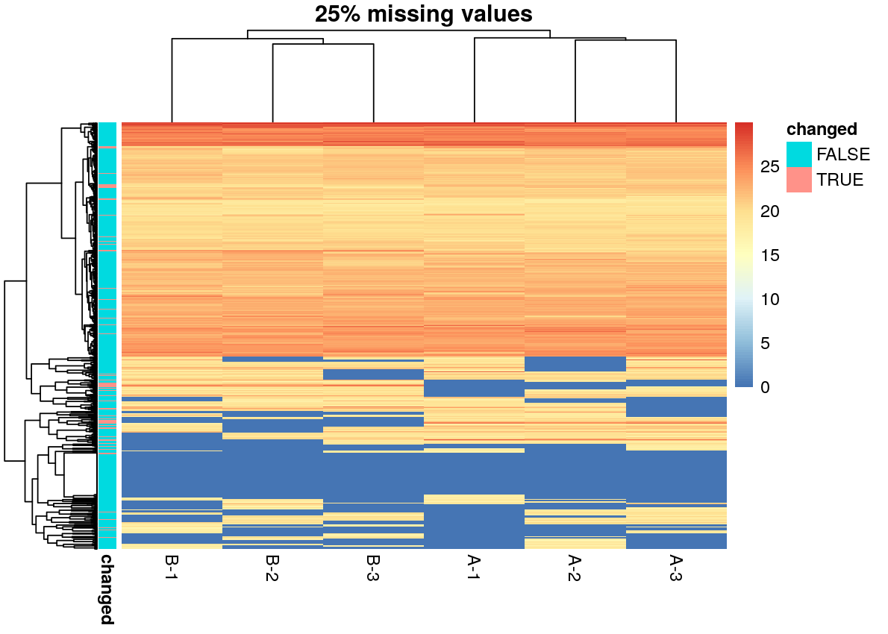
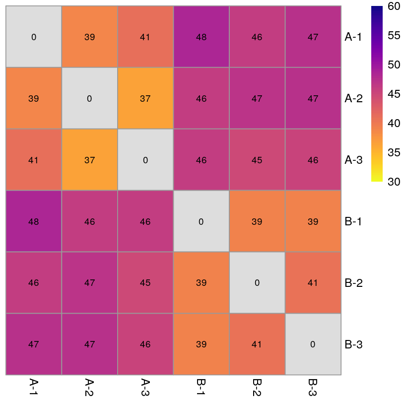
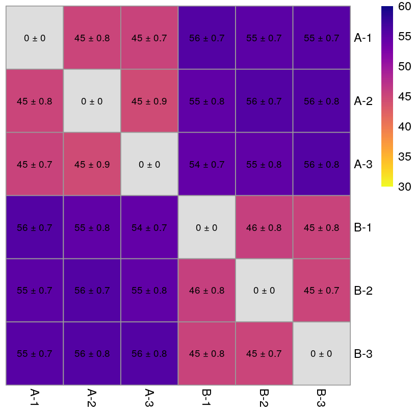
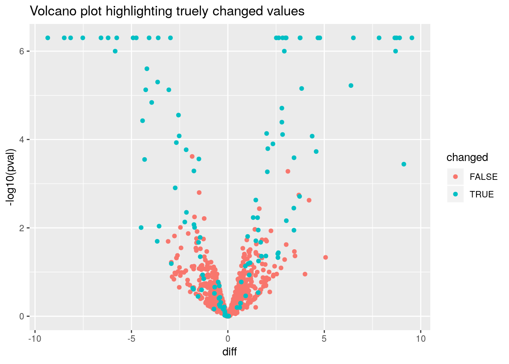
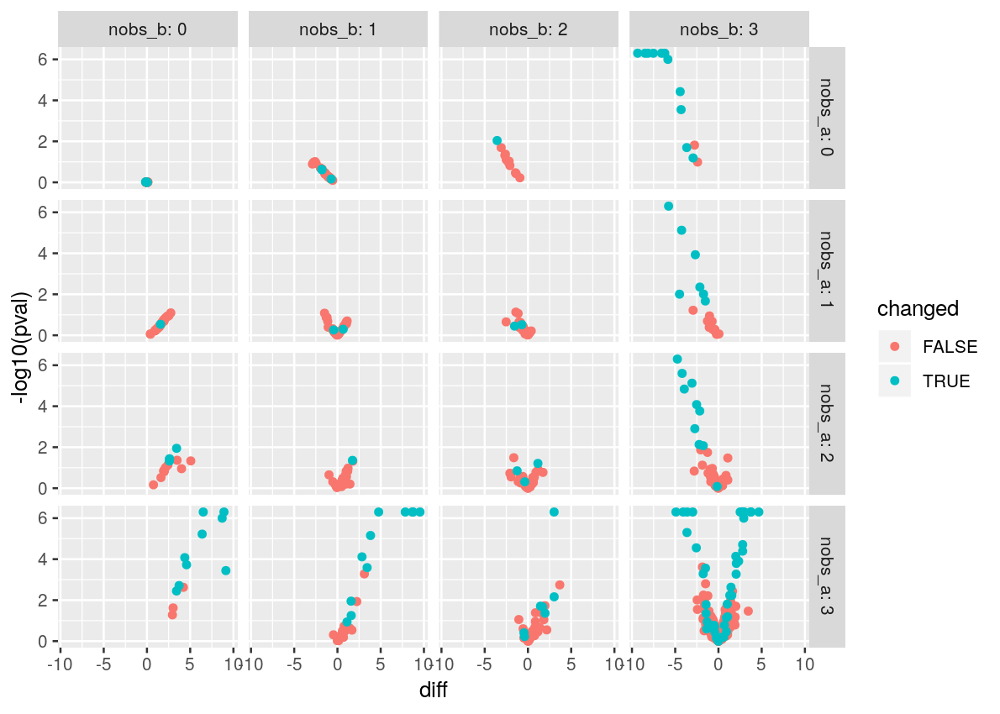
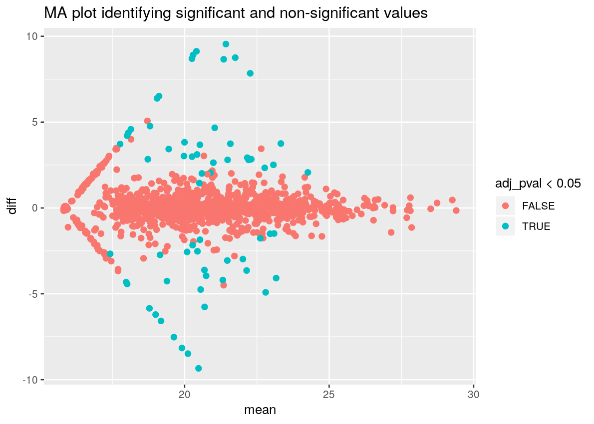

<!-- README.md is generated from README.Rmd. Please edit that file -->
proDD
=====

Differential Detection for Label-free (LFQ) Mass Spectometry Data

The tool fits a probabilistic dropout model to an intensity matrix from from label-free quantification (LFQ). Dropouts in LFQ data occur if the protein has a low intensity. Our model takes the non-random missingness into account, by constructing a Bayesian hierarchical model. After fitting the model you can sample from the posterior distribution of the means from each protein and condition. The posterior are a useful element to calculate all kind of statistics/metrics including the probability that the intensity of a protein in one condition is smaller than in the control (similar to the one-sided p-value).

Installation
============

Install the latest version directly from GitHub (make sure that `devtools` is installed)

``` r
devtools::install_github("const-ae/proDD")
```

Disclaimer
==========

I am still actively working on the project and although the algorithm is working fine at this point, the API
might still be subject to change.

Walkthrough
===========

In the following section I will explain how to use the `proDD` package to identify differential detected protein in label-free mass spectrometry data. I will highlight all the important functions the package provides.

At first we have to load the `proDD` package and some additional packages that we will use to plot our data.

``` r
# My package
library(proDD)

# Packages for plotting
library(ggplot2)
library(pheatmap)
library(viridisLite)
set.seed(1)
```

Next we will load some data. To make our life easier we will use synthetic data, where we know which proteins have changed and which have not. For this we will use the `generate_synthetic_data()`. We define that 10% of the protein differ between condtion A and B.

``` r

# The experimental_design is a vector that assignes each sample to one condition
experimental_design <- c("A", "A", "A", "B", "B", "B")

# The generate_synthetic_data can be customized a lot, but here we will 
# use it in its most basic form
syn_data <- generate_synthetic_data(n_rows=1234, experimental_design=experimental_design,
                                    frac_changed = 0.1)

# The data matrix, where non-observed values are coded as NA
X <- syn_data$X

# The columns are the samples and each row is a protein
head(X)
#>                A-1      A-2      A-3      B-1      B-2      B-3
#> protein_1 26.01637 26.19815 24.34241 25.16535 26.44820 25.78622
#> protein_2 21.32026 21.03830 20.82801 22.09844 21.64022 21.11569
#> protein_3 22.07577 21.82087 22.03724 21.88494 22.54764 22.00424
#> protein_4 27.27920 26.88433 27.16552 26.33441 27.62639 26.83863
#> protein_5 17.94647 17.67842 17.69316 17.73461 17.95657       NA
#> protein_6 24.16161 24.13973 24.81110 24.96692 24.84591 23.41231
```

To get a better impression of the raw data we will make a heatmap plot (using the `pheatmap` package). Unfortunately the `hclust` method that is internally used does not support missing values, so we will for this plot just replace all missing values with a zero

``` r
X_for_plotting <- X
X_for_plotting[is.na(X_for_plotting)] <- 0
pheatmap(X_for_plotting,
         main=paste0(round(sum(is.na(X))/prod(dim(X)) * 100), "% missing values"),
         annotation_row = data.frame(changed=as.factor(syn_data$changed),
                                     row.names = rownames(X_for_plotting)),
         show_rownames = FALSE)
```



One important observation is that the missing values do not occur randomly, but predominantly at low intensities. This can be most clearly be seen, when looking at proteins which have some observed and some missing values

``` r
hist_tmp_data <- data.frame(intensity=c(X), 
           row_has_missing=c(t(apply(X, 1, function(x) rep(any(is.na(x)), ncol(X))))))

ggplot(hist_tmp_data, aes(x=intensity, fill=row_has_missing)) +
    geom_histogram() +
    xlim(12, 32)
#> `stat_bin()` using `bins = 30`. Pick better value with `binwidth`.
#> Warning: Removed 1851 rows containing non-finite values (stat_bin).
#> Warning: Removed 4 rows containing missing values (geom_bar).
```


We conclude from this that there is a certain dropout probability associated with each latent intensity. At low intensities (e.g. `<15`) it is almost certain that the values dropout, whereas for high intensities (e.g. `>25`) almost no value is missing. We capture this idea using a sigmoidal shaped dropout curve that looks roughly like this:

``` r
dropout_curve <- data.frame(intensity=seq(12, 32, length.out=1001))
dropout_curve$dropout_probability <- invprobit(dropout_curve$intensity, rho=18, zeta=-2.5)

ggplot(hist_tmp_data, aes(x=intensity)) +
    geom_histogram(aes(fill=row_has_missing)) +
    geom_line(data=dropout_curve, aes(y=dropout_probability * 600), color="red") +
    xlim(12, 32)
#> `stat_bin()` using `bins = 30`. Pick better value with `binwidth`.
#> Warning: Removed 1851 rows containing non-finite values (stat_bin).
#> Warning: Removed 4 rows containing missing values (geom_bar).
```


Our probabilistic dropout algorithm has two major steps. In the first step we infer important hyper-parameters of the model using an EM algorithm. The hyper-parameters that we identify are

-   the location and scale of the dropout curve for each sample (called `rho` and `zeta`)
-   the overal location of the values (`mu0` and `sigma20`)
-   a prior for the protein variances (`nu` and `eta`).

``` r
# To see the progress while fitting set verbose=TRUE
params <- fit_parameters(X, experimental_design)
params
#>  Parameters of the probabilistic dropout model
#> 
#> There were 6 samples in 2 conditons. In total there were 1234 rows.
#> The model has successfully converged.
#> The error of the last iteration was 0.0003331
#> 
#> The inferred parameters are:
#> eta:      0.302
#> nu:       3.09
#> mu0:      20.5
#> sigma20:  7.88
#> rho:      18.4, 18.4, 18.3, 18.4, 18.4, 18.4
#> zeta:     -1.05, -1.11, -1.04, -1.04, -0.916, -1.06
```

As we can see the method has successfully converged so we can continue. If it would not have converged increase `max_iter`. In this example we are working on a moderately sized data set, usually a thousand proteins are enough to make good estimates of the hyper-parameters, if your dataset has many proteins you can easily speed up the inference by setting for example `n_subsample=1000`.

Knowing the general distribution of our data, we might be interested how the samples are related. Naively we would just calculate the distance matrix using `dist(t(X))`. But `dist` simply scales up vectors containing missing values, which is equivalent to some kind of mean imputation, which does not really make sense as we have seen when we looked where missing values actually occur.

``` r
naive_dist <- dist(t(X))
pheatmap(as.matrix(naive_dist), cluster_rows=FALSE, cluster_cols = FALSE,
         color=viridisLite::plasma(n=100, direction=-1),
         breaks = seq(30, 60, length.out=101),
         display_numbers=round(as.matrix(naive_dist)),
         number_color = "black")
```



Instead our package provides a function called `dist_approx` that estimates the distances and properly takes into account the missing values. But due to the missing values we cannot be certain of the exact distance. Thus the function returns in addition to the best guess of the distance an estimate how variable that guess is.

``` r
# Removing condtion information to get unbiased results
dist_proDD <- dist_approx(X, params, by_sample=TRUE, blind=TRUE)
# The mean and standard deviation of the sample distance estimates
pheatmap(as.matrix(dist_proDD$mean), cluster_rows=FALSE, cluster_cols=FALSE,
         color=viridisLite::plasma(n=100, direction=-1),
         breaks = seq(30, 60, length.out=101),
         display_numbers=matrix(paste0(round(as.matrix(dist_proDD$mean)), " ± ",
                              round(sqrt(as.matrix(dist_proDD$var)), 1)), nrow=6),
         number_color = "black")
```



After making sure that there are no extreme outliers in our data and the heatmap shows the group structure that we expected, we will continue to infer the posterior distribution of the mean for each protein and condition.

Those posterior distribution form the basis of the subsequent steps for identifying differentially detected proteins.

``` r
# Internally this function uses Stan to sample the posteriors.
# Stan provides a lot of output which you can see by setting verbose=TRUE
posteriors <- sample_protein_means(X, params, verbose=FALSE)
```

Now that we have a good idea what is the latent intensity of each protein we can go on to identify the differentially detected proteins

``` r
result <- test_diff(posteriors$A,  posteriors$B)

# The resulting data.frame
head(result)
#>                name      pval  adj_pval        diff diff_quantile_0.025
#> protein_1 protein_1 0.6519370 0.9999930 -0.30277704          -1.6623174
#> protein_2 protein_2 0.2023475 0.8761292 -0.55093833          -1.4280952
#> protein_3 protein_3 0.6476790 0.9999930 -0.16726281          -0.9458469
#> protein_4 protein_4 0.7382940 0.9999930  0.15303903          -0.7856018
#> protein_5 protein_5 0.9150940 0.9999930 -0.04570317          -0.9518597
#> protein_6 protein_6 0.9527940 0.9999930 -0.02652622          -1.1187081
#>           diff_quantile_0.975     mean
#> protein_1           1.0567892 25.50960
#> protein_2           0.3548970 21.33132
#> protein_3           0.6407038 22.04862
#> protein_4           1.1298421 26.92508
#> protein_5           0.8541871 17.82200
#> protein_6           1.1394976 24.30923

# The most significant changes
head(result[order(result$pval), ])
#>                      name  pval     adj_pval     diff diff_quantile_0.025
#> protein_1123 protein_1123 5e-07 2.127586e-05 3.756010            2.887895
#> protein_1125 protein_1125 5e-07 2.127586e-05 8.684136            5.395122
#> protein_1136 protein_1136 5e-07 2.127586e-05 6.082129            3.770749
#> protein_1150 protein_1150 5e-07 2.127586e-05 3.726091            2.832252
#> protein_1151 protein_1151 5e-07 2.127586e-05 8.666559            7.539040
#> protein_1153 protein_1153 5e-07 2.127586e-05 8.524979            6.537474
#>              diff_quantile_0.975     mean
#> protein_1123            4.575237 21.58930
#> protein_1125           12.403347 20.66842
#> protein_1136            9.482807 19.31900
#> protein_1150            4.489075 23.33110
#> protein_1151            9.859986 21.78647
#> protein_1153           10.244433 21.41580
```

A popular way to look at such data is to make a volcano plot. Here we will use the fact that we generated the data to highlight proteins that were actually changed

``` r
result$changed <- syn_data$changed

ggplot(result, aes(x=diff, y=-log10(pval), color=changed)) +
    geom_point() +
    ggtitle("Volcano plot highlighting truely changed values")
```



We know that 10% of the data was changed and in the volcano plot we can see that our method does a good job of identifying many of them.

An interesting way to look at at the data is to explicitly look how many values were observed per condition. So we will make 16 plots, where we compare the difference between for A and B if we had three 3 vs. 3, 3 vs. 2, 3 vs. 1 etc. observed values.

``` r
result$nobs_a <- rowSums(! is.na(X[, experimental_design == "A"]))
result$nobs_b <- rowSums(! is.na(X[, experimental_design == "B"]))

ggplot(result, aes(x=diff, y=-log10(pval), color=changed)) +
    geom_point() +
    facet_grid(nobs_a ~ nobs_b, labeller = label_both)
```



Using this data we can also make an MA plot, where we color the points by the number of observations

``` r
result$label <- paste0(pmax(result$nobs_a, result$nobs_b), "-", pmin(result$nobs_a, result$nobs_b))

ggplot(result, aes(x=mean, y=diff, color=label, shape=changed)) +
    geom_point(size=2) +
    ggtitle("MA plot comparing the number of observed values")
```


``` r

ggplot(result, aes(x=mean, y=diff, color=adj_pval < 0.05)) +
    geom_point(size=2) +
    ggtitle("MA plot identifying significant and non-significant values")
```


